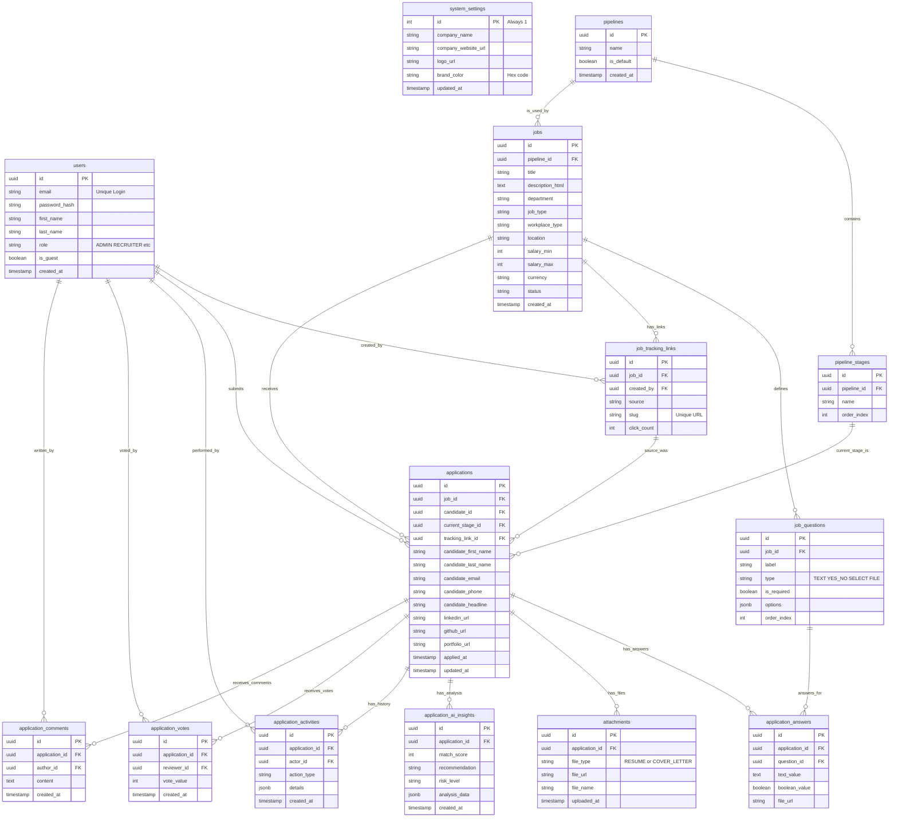

```mermaid
erDiagram

%% ==========================================
%% 1. SYSTEM CONFIGURATION
%% ==========================================

    system_settings {
        int id PK "Always 1"
        string company_name
        string company_website_url
        string logo_url
        string brand_color "Hex code"
        timestamp updated_at
    }

    %% ==========================================
    %% 2. USERS AND PROFILES
    %% ==========================================

    users {
        uuid id PK
        string email "Unique Login"
        string password_hash
        string first_name
        string last_name
        string role "ADMIN RECRUITER etc"
        boolean is_guest
        timestamp created_at
    }

    %% ==========================================
    %% 3. PIPELINES AND JOBS
    %% ==========================================

    pipelines {
        uuid id PK
        string name
        boolean is_default
        timestamp created_at
    }

    pipeline_stages {
        uuid id PK
        uuid pipeline_id FK
        string name
        int order_index
    }

    jobs {
        uuid id PK
        uuid pipeline_id FK
        string title
        text description_html
        string department
        string job_type
        string workplace_type
        string location
        int salary_min
        int salary_max
        string currency
        string status
        timestamp created_at
    }

    %% ==========================================
    %% 4. FORM BUILDER
    %% ==========================================

    job_questions {
        uuid id PK
        uuid job_id FK
        string label
        string type "TEXT YES_NO SELECT FILE"
        boolean is_required
        jsonb options
        int order_index
    }

    job_tracking_links {
        uuid id PK
        uuid job_id FK
        uuid created_by FK
        string source
        string slug "Unique URL"
        int click_count
    }

    %% ==========================================
    %% 5. APPLICATIONS
    %% ==========================================

    applications {
        uuid id PK
        uuid job_id FK
        uuid candidate_id FK
        uuid current_stage_id FK
        uuid tracking_link_id FK
        string candidate_first_name
        string candidate_last_name
        string candidate_email
        string candidate_phone
        string candidate_headline
        string linkedin_url
        string github_url
        string portfolio_url
        timestamp applied_at
        timestamp updated_at
    }

    application_answers {
        uuid id PK
        uuid application_id FK
        uuid question_id FK
        text text_value
        boolean boolean_value
        string file_url
    }

    attachments {
        uuid id PK
        uuid application_id FK
        string file_type "RESUME or COVER_LETTER"
        string file_url
        string file_name
        timestamp uploaded_at
    }

    %% ==========================================
    %% 6. AI AND ANALYSIS
    %% ==========================================

    application_ai_insights {
        uuid id PK
        uuid application_id FK
        int match_score
        string recommendation
        string risk_level
        jsonb analysis_data
        timestamp created_at
    }

    %% ==========================================
    %% 7. REVIEW AND ACTIVITY
    %% ==========================================

    application_activities {
        uuid id PK
        uuid application_id FK
        uuid actor_id FK
        string action_type
        jsonb details
        timestamp created_at
    }

    application_votes {
        uuid id PK
        uuid application_id FK
        uuid reviewer_id FK
        int vote_value
        timestamp created_at
    }

    application_comments {
        uuid id PK
        uuid application_id FK
        uuid author_id FK
        text content
        timestamp created_at
    }

    %% ==========================================
    %% RELATIONSHIPS
    %% ==========================================

    pipelines ||--o{ pipeline_stages : contains
    pipelines ||--o{ jobs : is_used_by

    jobs ||--o{ job_questions : defines
    jobs ||--o{ job_tracking_links : has_links
    jobs ||--o{ applications : receives

    users ||--o{ job_tracking_links : created_by
    users ||--o{ applications : submits
    users ||--o{ application_activities : performed_by
    users ||--o{ application_votes : voted_by
    users ||--o{ application_comments : written_by

    pipeline_stages ||--o{ applications : current_stage_is
    job_tracking_links ||--o{ applications : source_was

    applications ||--o{ application_answers : has_answers
    applications ||--o{ attachments : has_files
    applications ||--o{ application_ai_insights : has_analysis

    applications ||--o{ application_activities : has_history
    applications ||--o{ application_votes : receives_votes
    applications ||--o{ application_comments : receives_comments

    job_questions ||--o{ application_answers : answers_for
```
